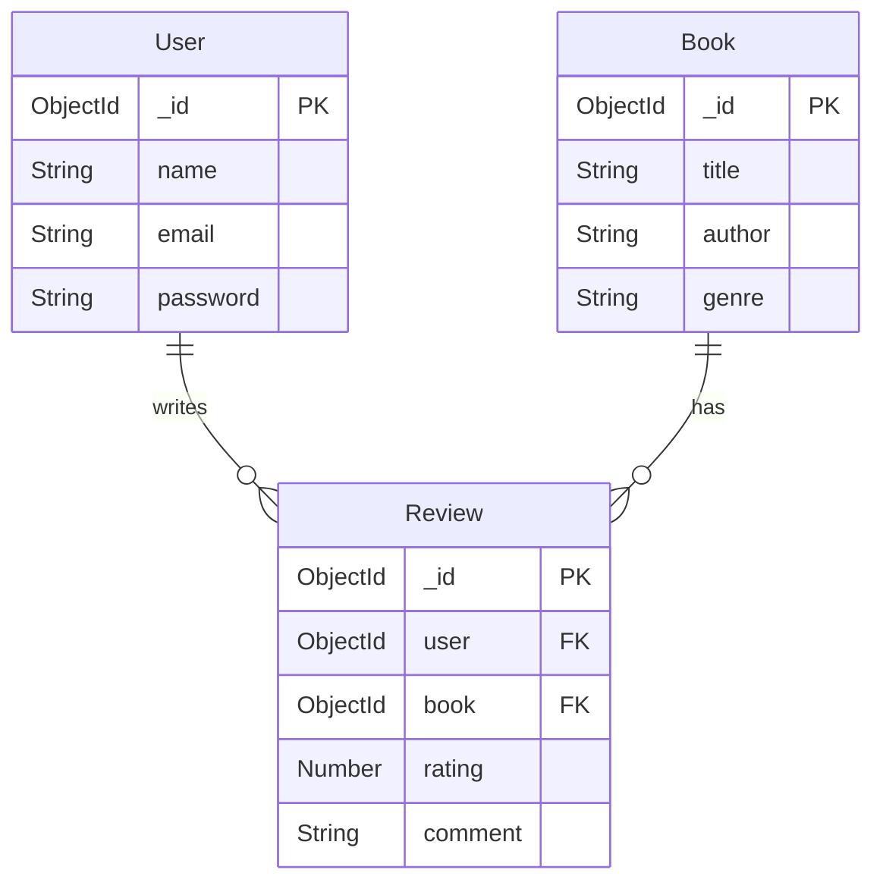

# Book-Review-App
A RESTful API built using Node.js, Express.js, and MongoDB, allowing users to manage books and post reviews. Authenticated users can add books, post reviews, and manage their own content. This project demonstrates secure backend development, clean modular code, and well-designed API architecture.

## Features
- User Signup & Login (JWT-based authentication)
- Add and View Books with pagination, filtering, and search
- Post one review per book per user
- Update or delete your own reviews
- Search books by title or author (partial & case-insensitive)
- Modular project structure for scalability

## Tech Stack
- Backend: Node.js, Express.js
- Database: MongoDB (Mongoose)
- Authentication: JWT (JSON Web Tokens)
- Environment Config: dotenv
- Pagination & Filtering: Built-in query options

##  Project Structure
```
  bookstacker/
│
├── controllers/       # Route controllers (logic)
├── services/          # Business logic
├── models/            # Mongoose schemas
├── routes/            # Route definitions
├── middleware/        # JWT auth, error handlers
├── config/            # DB and env config
├── .env               # Secret keys & config
├── server.js          # App entry point
└── README.md

```
## Setup Instructions
1. Clone the repo
   ```bash
   git clone https://github.com/ConnectRajiv/Book-review.git
   cd Book-Review-App
   ```
2. Install dependencies
   ```bash
   npm install
   ```
4. Create a .env file
   ```.env
   PORT=5000
   MONGO_URI=your_mongodb_uri
   JWT_SECRET=your_jwt_secret_key
   
   ```
5. Start Server
   ```bash
   node server.js
   ```
  Your API will be running at
  ```bash
  http://localhost:5000
  ```
##  API Endpoints
```POST /api/auth/signup```

```POST /api/auth/login```

```POST /api/books (auth)```

```GET /api/books```

```GET /api/books/:id```

```POST /api/books/:id/reviews (auth)```

```PUT /api/reviews/:id (auth)```

```DELETE /api/reviews/:id (auth)```

```GET /api/books/search?q=title```
###  Authentication Endpoints
1. Signup – Register
   ```http 
   POST /auth/signup
   Content-Type: application/json
   {
   "name": "Rajiv",
   "email": "Rajiv@abc.com",
   "password": "password123"
   }

   ```
2. Login and Get JWT
   ```http
   POST /auth/login
   {
   "email": "Rajiv@abc.com",
   "password": "password123"
   }
   ```
###  Book Endpoints
1. POST /books – Add Book (Auth Required)
    ```http
    POST /books
    Authorization: Bearer <JWT>
    {
    "title": "Clean Code",
    "author": "Premchand",
    "genre": "story"
    }
    ```
2.  GET /books – List Books (pagination, filter)
    ```http
    GET /books?page=1&limit=10&author=Premchand=Story
    ```
 3. GET /books/:id – Book Details with Avg Rating + Reviews
    ```http
    GET /books/abc123
    ```
###  Review Endpoints
1.  POST /books/:id/reviews (One review per user per book)
    ```http
    POST /books/abc123/reviews
    Authorization: Bearer <JWT>
    {
    "rating": 4,
    "comment": "Great book!"
    }
    ```
2. PUT /reviews/:id – Update Own Review
    ```http
    PUT /reviews/xyz456
    Authorization: Bearer <JWT>
    {
    "rating": 5,
    "comment": "Actually, it was amazing!"
    }
    ```
3. DELETE /reviews/:id – Delete Own Review
    ```http
    DELETE /reviews/xyz456
    Authorization: Bearer <JWT>
    ```
###  /search – Search Books by Title or Author
  ```http
  GET /search?q=clean
  ```
##  MongoDB Schema (Simple Overview)
1. User
```js
{
  name: String,
  email: { type: String, unique: true },
  password: String
}
```
2. Book
```js
{
  title: String,
  author: String,
  genre: String,
  reviews: [ObjectId], // References to Review
}
```
3. Review
```js
{
  user: ObjectId,
  book: ObjectId,
  rating: Number,
  comment: String
}
```
##  Database Schema Design

 **Key Entities:**
- **User:** Stores user credentials and basic details.
- **Book:** Contains book information like title, author, and genre.
- **Review:** Connects a user and a book through a one-to-one relationship per book, with a rating and comment.

###  User

| Field      | Type      | Description             |
|------------|-----------|-------------------------|
| `_id`      | ObjectId  | Primary key             |
| `name`     | String    | User’s full name        |
| `email`    | String    | Unique email            |
| `password` | String    | Hashed password         |

---

###  Book

| Field      | Type      | Description             |
|------------|-----------|-------------------------|
| `_id`      | ObjectId  | Primary key             |
| `title`    | String    | Title of the book       |
| `author`   | String    | Author's name           |
| `genre`    | String    | Book genre              |

---

###  Review

| Field      | Type      | Description                       |
|------------|-----------|-----------------------------------|
| `_id`      | ObjectId  | Primary key                       |
| `user`     | ObjectId  | Reference to the User (`_id`)     |
| `book`     | ObjectId  | Reference to the Book (`_id`)     |
| `rating`   | Number    | Rating (e.g., 1 to 5)             |
| `comment`  | String    | Review comment                    |

###  ER Diagram

The following diagram represents the core entities and their relationships in the Book Review API system.



 ###  Relationships
 - A User can write many Reviews, but only one review per Book.
 - A Book can have many Reviews.
 - Each Review belongs to one User and one Book.
   
##  Design Decisions & Assumptions
### Design Decisions
- **Modular Structure**: Separated controllers (handle requests) and services (handle logic) for cleaner code.
- **JWT Authentication**: Protected routes require JWT in the Authorization header.
- **One Review per Book per User**: Enforced to maintain review uniqueness.
- **Pagination**: Default limit = 10 in book and review listings.
- **Search**: Case-insensitive partial match for title and author using regex.
- **Protected Routes**: Only logged-in users can add books or reviews.

###  Assumptions
- All users are treated equally (no roles like admin).
- Users can update or delete only their own reviews.
- Basic validation is handled via Mongoose.
- No advanced features like likes, replies, or media for now.

##  Author
### Rajiv Ranjan


